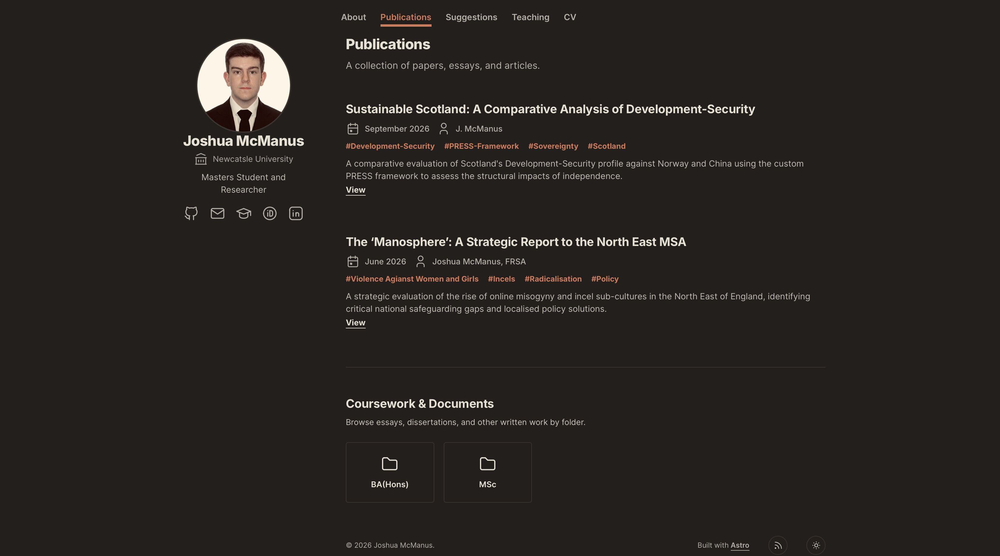

# My Website

[](https://astro.build/)
[](https://tailwindcss.com/)
[](https://www.typescriptlang.org/)
[](https://opensource.org/license/mit)




## About
This is the README.md for my personal website [(found here)](https://www.JAJM2006.uk).


## Tree
```
├── .github/workflows/          # CI/CD deployment
├── .vscode/                    # Editor configurations
├── [6 root files]              # .gitignore, package.json, Astro config, etc.
├── guides/                     # Content guides & examples
├── public/                     # Static assets
│   ├── images/
│   ├── works/                  # University coursework files
│   │   ├── BA(Hons)/           # Year 1 & 2 essays and reports
│   │   └── MSc/                # Master's degree files
│   └── [7 static files]        # CV, icons, robots.txt, images
└── src/                        # Astro source code
    ├── assets/icons/           # Global SVG icons
    ├── components/             # Reusable UI components
    │   ├── content/
    │   ├── layout/
    │   └── ui/
    ├── config/                 # Site & navigation settings
    ├── content/                # Markdown files (posts, projects, bio)
    ├── layouts/                # Astro page layouts
    ├── pages/                  # Routing and page views
    ├── styles/                 # Global CSS styles
    ├── types/                  # TypeScript definitions
    ├── utils/                  # Utility & helper functions
    └── content.config.ts       # Astro content configuration
```


## Templates.
This website utilises [Rubzip's Template](https://github.com/rubzip/academic-portfolio-astro/), which itself is based on [Academic Pages](https://github.com/academicpages/academicpages.github.io) and [AstroPaper](https://github.com/satnaing/astro-paper). 

